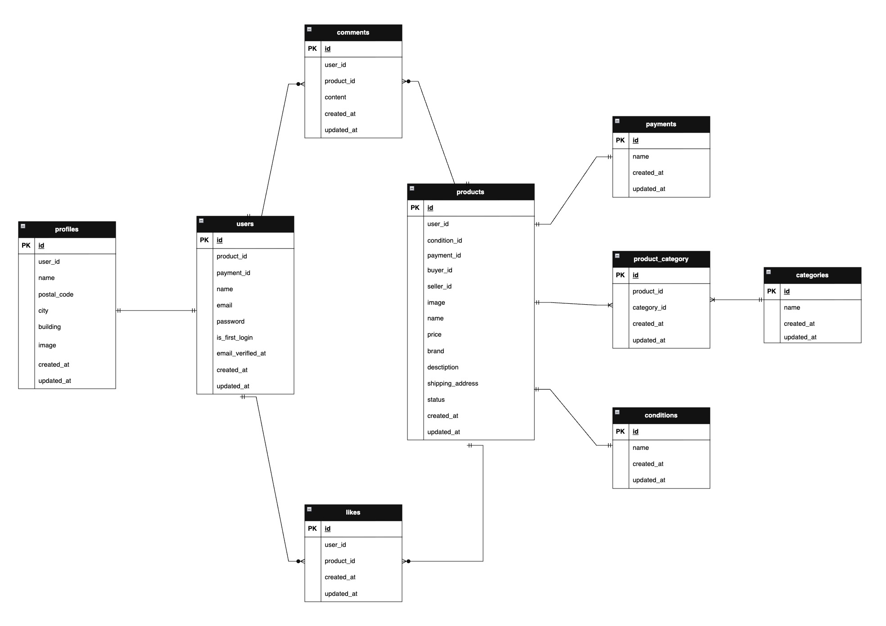

# coachtech-flea-market

## 環境構築

**Docker ビルド**

1. `git clone git@github.com:itanohiroyuki/coachtech-flea-market.git`
2. cd coachtech-flea-market
3. DockerDesktop アプリを立ち上げる
4. `docker-compose up -d --build`

**Laravel 環境構築**

1. `docker-compose exec php bash`
2. `composer install`
3. 「.env.example」ファイルを 「.env」ファイルに命名を変更。または、新しく.env ファイルを作成
4. .env に以下の環境変数を追加(stripe 関連は、各自適切なものを設定してください)

```text
DB_CONNECTION=mysql
DB_HOST=mysql
DB_PORT=3306
DB_DATABASE=laravel_db
DB_USERNAME=laravel_user
DB_PASSWORD=laravel_pass
SESSION_DRIVER=database

以降は各々設定

MAIL_FROM_ADDRESS=（各自設定）
STRIPE_KEY=（各自設定）
STRIPE_SECRET=（各自設定）
STRIPE_WEBHOOK_SECRET=（各自設定）
```

5. アプリケーションキーの作成

```bash
php artisan key:generate
```

6. マイグレーションの実行

```bash
php artisan migrate
```

7. シーディングの実行

```bash
php artisan db:seed
```

8. シンボリックリンク作成

```bash
php artisan storage:link
```

## stripe 決済

**コンビニ決済の場合の処理手順**

1. `stripe login`
   続けて Enter
2. `stripe listen --forward-to http://localhost/webhook/stripe`
3. `stripe payment_intents mark_as_paid xxx`
   xxx に支払い番号を入れてください
4. その後`localhost/`にアクセスすると購入処理が反映されます。

## 使用技術(実行環境)

- PHP8 .4.1
- Laravel 8.83.27
- MariaDB 11.8.3
- Fortify v1.19.1
- stripe v19.0.0

## テーブル設計


## ER 図



## URL

- 開発環境：http://localhost/
- phpMyAdmin：http://localhost:8080/
- mailhog：http://localhost:8025
